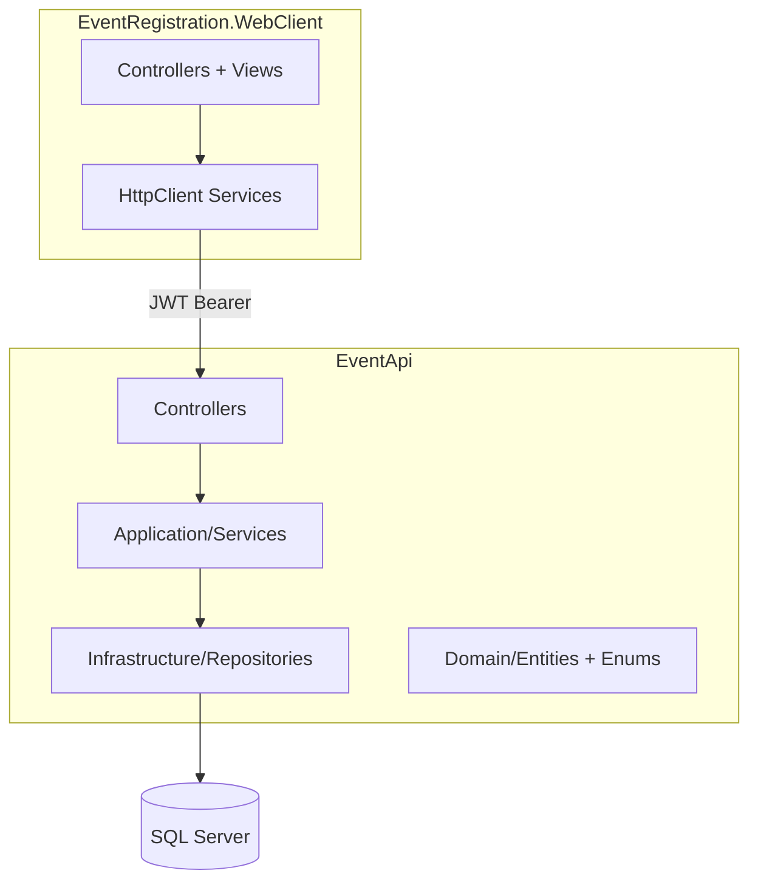
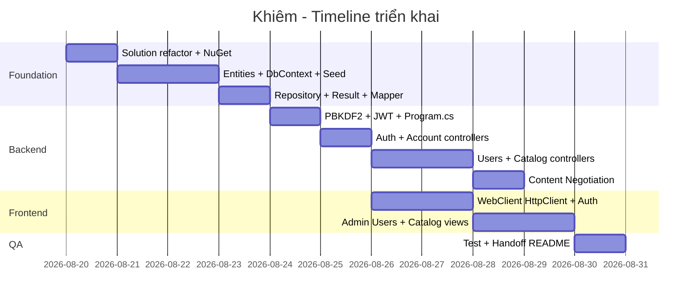

# Plan triển khai code — Khiêm (Thành viên 1)

> **Student Event Registration System (PRN232)**  
> Phạm vi: Auth, User & Catalog Management + Content Negotiation + Base Architecture  
> Use Cases: UC01, UC02, UC03, UC09, UC10  
> Business Rules: BR-G-01, BR-G-02, BR-G-03, BR-G-04, BR-E-05

---

## Bối cảnh hiện tại

- Solution: `EventRegistration.sln` — ASP.NET Core 8 Web API scaffold.
- Remote Git: `https://github.com/khiem1301/PRN232-EventRegistration.git`
- Kiến trúc đã chọn: **2 project** (`EventApi` + `WebClient`), phân lớp bằng **folder** bên trong.

---

## Kiến trúc mục tiêu



### Cấu trúc thư mục sau refactor

```
EventRegistration/
├── EventRegistration.sln
├── EventApi/                          # đổi tên từ EventRegistration/
│   ├── Domain/
│   │   ├── Entities/                  # User, Location, Organizer, Event (stub)
│   │   ├── Enums/                     # UserRole
│   │   └── Common/                    # Result<T>, PagedResult<T>
│   ├── Application/
│   │   ├── DTOs/                      # Auth, User, Location, Organizer DTOs
│   │   ├── Interfaces/                # IAuthService, IUserService, ...
│   │   ├── Services/                  # AuthService, UserService, ...
│   │   └── Mapping/                   # AutoMapper profiles
│   ├── Infrastructure/
│   │   ├── Data/                      # AppDbContext, Configurations, Seed
│   │   ├── Repositories/              # GenericRepository, UnitOfWork
│   │   └── Security/                  # PasswordHasher (PBKDF2), JwtTokenService
│   ├── Controllers/
│   │   ├── AuthController.cs
│   │   ├── AccountController.cs
│   │   ├── UsersController.cs
│   │   ├── LocationsController.cs
│   │   └── OrganizersController.cs
│   ├── Program.cs
│   └── appsettings.json
└── EventRegistration.WebClient/
    ├── Controllers/
    ├── Models/
    ├── Services/
    ├── Views/
    └── wwwroot/
```

**Ghi chú phối hợp nhóm:** Khiêm sở hữu `AppDbContext` và migration ban đầu. TV2/TV3 sẽ **thêm entity** (`Event`, `Registration`, `Feedback`) vào cùng `Infrastructure/Data/` — không tạo DbContext riêng.

---

## Checklist tiến độ

| Phase | Nội dung | Trạng thái |
|-------|----------|------------|
| 0 | Refactor Solution, NuGet, appsettings, CORS | [x] |
| 1 | Entities, DbContext, Seed, Migration | [x] |
| 2 | Result, Repository, UnitOfWork, AutoMapper | [x] |
| 3 | PBKDF2, JWT, Authorization policies | [x] |
| 4 | Auth/Account/Users/Catalog API | [x] |
| 5 | Content Negotiation JSON/XML | [x] |
| 6 | MVC WebClient | [x] |
| 7 | Test + Integration Contract README | [x] |

---

## Phase 0 — Chuẩn bị Solution

| Việc | Chi tiết |
|------|----------|
| Đổi tên project | `EventRegistration` → `EventApi` |
| Xóa scaffold mẫu | Xóa `WeatherForecast.cs`, `WeatherForecastController.cs` |
| Thêm WebClient | `dotnet new mvc -n EventRegistration.WebClient` |
| NuGet — EventApi | EF Core SqlServer, EF Tools, JwtBearer, AutoMapper, Swashbuckle |

### appsettings.json

```json
{
  "ConnectionStrings": {
    "DefaultConnection": "Server=localhost;Database=EventRegistrationDB;Trusted_Connection=True;TrustServerCertificate=True"
  },
  "Jwt": {
    "Key": "EventRegistrationSecretKey2026Min32Chars!",
    "Issuer": "EventApi",
    "Audience": "EventWebClient",
    "ExpireMinutes": 60
  },
  "Logging": {
    "LogLevel": {
      "Default": "Information",
      "Microsoft.AspNetCore": "Warning"
    }
  },
  "AllowedHosts": "*"
}
```

### Lệnh khởi tạo

```bash
cd "d:\01.LEARNING MATERIALS\FPT University\Semester 8\PRN232\BL5\EventRegistration"

# Đổi tên folder (nếu chưa đổi)
# EventRegistration -> EventApi

dotnet new mvc -n EventRegistration.WebClient
dotnet sln add EventApi/EventApi.csproj
dotnet sln add EventRegistration.WebClient/EventRegistration.WebClient.csproj

dotnet add EventApi package Microsoft.EntityFrameworkCore.SqlServer
dotnet add EventApi package Microsoft.EntityFrameworkCore.Tools
dotnet add EventApi package Microsoft.AspNetCore.Authentication.JwtBearer
dotnet add EventApi package AutoMapper.Extensions.Microsoft.DependencyInjection
```

---

## Phase 1 — Domain Entities & Database

### 1.1 Entities

**User**
- `Id`, `Email` (unique), `PasswordHash`, `PasswordSalt`
- `FullName`, `StudentCode?`, `Phone?`
- `Role` (Student | Staff | Admin)
- `IsActive`, `CreatedAt`, `UpdatedAt`

**Location**
- `Id`, `Name`, `Address`, `Description?`, `Capacity?`
- `IsActive`, `CreatedAt`, `UpdatedAt`
- Navigation: `ICollection<Event> Events`

**Organizer**
- `Id`, `Name`, `ContactEmail`, `ContactPhone`, `Description?`
- `IsActive`, `CreatedAt`, `UpdatedAt`
- Navigation: `ICollection<Event> Events`

**Event (stub — TV2 mở rộng)**
- `Id`, `LocationId`, `OrganizerId`

### 1.2 Seed Data

| Email | Password | Role |
|-------|----------|------|
| admin@fpt.edu.vn | Admin@123 | Admin |
| staff@fpt.edu.vn | Staff@123 | Staff |

+ 2–3 Location, 2 Organizer mẫu.

### 1.3 Migration

```bash
dotnet ef migrations add Initial_Khiem_User_Location_Organizer -p EventApi
dotnet ef database update -p EventApi
```

### 1.4 BR-E-05 guard (Catalog delete)

```csharp
if (await _context.Events.AnyAsync(e => e.LocationId == id))
    return Result<object>.Fail("Cannot delete: location is referenced by events.", 409);
```

---

## Phase 2 — Core Patterns

### Result<T>

```csharp
namespace EventApi.Domain.Common;

public class Result<T>
{
    public bool IsSuccess { get; init; }
    public T? Data { get; init; }
    public string? Error { get; init; }
    public int StatusCode { get; init; } = 200;

    public static Result<T> Success(T data, int statusCode = 200) =>
        new() { IsSuccess = true, Data = data, StatusCode = statusCode };

    public static Result<T> Fail(string error, int statusCode = 400) =>
        new() { IsSuccess = false, Error = error, StatusCode = statusCode };
}

public class PagedResult<T>
{
    public IEnumerable<T> Items { get; set; } = [];
    public int TotalCount { get; set; }
    public int Page { get; set; }
    public int PageSize { get; set; }
}
```

### Controller helper

```csharp
protected IActionResult ToActionResult<T>(Result<T> result)
{
    if (result.IsSuccess)
        return StatusCode(result.StatusCode, result.Data);

    return StatusCode(result.StatusCode, new { error = result.Error });
}
```

---

## Phase 3 — Security (PBKDF2 + JWT)

### PasswordHasher.cs — BR-G-03

```csharp
using System.Security.Cryptography;

namespace EventApi.Infrastructure.Security;

public static class PasswordHasher
{
    private const int SaltSize = 16;
    private const int KeySize = 32;
    private const int Iterations = 100_000;

    public static (string hash, string salt) HashPassword(string password)
    {
        var saltBytes = RandomNumberGenerator.GetBytes(SaltSize);
        var hashBytes = DeriveKey(password, saltBytes);
        return (Convert.ToBase64String(hashBytes), Convert.ToBase64String(saltBytes));
    }

    public static bool VerifyPassword(string password, string hash, string salt)
    {
        var saltBytes = Convert.FromBase64String(salt);
        var hashBytes = DeriveKey(password, saltBytes);
        var storedHash = Convert.FromBase64String(hash);
        return CryptographicOperations.FixedTimeEquals(hashBytes, storedHash);
    }

    private static byte[] DeriveKey(string password, byte[] salt) =>
        Rfc2898DeriveBytes.Pbkdf2(
            password, salt, Iterations, HashAlgorithmName.SHA256, KeySize);
}
```

### JwtTokenService.cs — UC02

```csharp
using System.IdentityModel.Tokens.Jwt;
using System.Security.Claims;
using System.Text;
using EventApi.Application.DTOs;
using EventApi.Domain.Entities;
using Microsoft.IdentityModel.Tokens;

namespace EventApi.Infrastructure.Security;

public class JwtTokenService(IConfiguration configuration)
{
    public LoginResponseDto GenerateToken(User user, UserDto userDto)
    {
        var jwtSettings = configuration.GetSection("Jwt");
        var key = new SymmetricSecurityKey(Encoding.UTF8.GetBytes(jwtSettings["Key"]!));
        var expireMinutes = int.Parse(jwtSettings["ExpireMinutes"] ?? "60");
        var expiresAt = DateTime.UtcNow.AddMinutes(expireMinutes);

        var claims = new[]
        {
            new Claim(JwtRegisteredClaimNames.Sub, user.Id.ToString()),
            new Claim(JwtRegisteredClaimNames.Email, user.Email),
            new Claim(ClaimTypes.Name, user.FullName),
            new Claim(ClaimTypes.Role, user.Role.ToString())
        };

        var token = new JwtSecurityToken(
            issuer: jwtSettings["Issuer"],
            audience: jwtSettings["Audience"],
            claims: claims,
            expires: expiresAt,
            signingCredentials: new SigningCredentials(key, SecurityAlgorithms.HmacSha256));

        return new LoginResponseDto
        {
            Token = new JwtSecurityTokenHandler().WriteToken(token),
            ExpiresAt = expiresAt,
            User = userDto
        };
    }
}
```

### Program.cs — DI & Middleware — BR-G-04

```csharp
using System.Text;
using EventApi.Application.Interfaces;
using EventApi.Application.Mapping;
using EventApi.Application.Services;
using EventApi.Infrastructure.Data;
using EventApi.Infrastructure.Repositories;
using EventApi.Infrastructure.Security;
using Microsoft.AspNetCore.Authentication.JwtBearer;
using Microsoft.EntityFrameworkCore;
using Microsoft.IdentityModel.Tokens;

var builder = WebApplication.CreateBuilder(args);

builder.Services.AddDbContext<AppDbContext>(options =>
    options.UseSqlServer(builder.Configuration.GetConnectionString("DefaultConnection")));

builder.Services.AddScoped<IUnitOfWork, UnitOfWork>();
builder.Services.AddScoped<IAuthService, AuthService>();
builder.Services.AddScoped<IAccountService, AccountService>();
builder.Services.AddScoped<IUserService, UserService>();
builder.Services.AddScoped<ILocationService, LocationService>();
builder.Services.AddScoped<IOrganizerService, OrganizerService>();
builder.Services.AddScoped<JwtTokenService>();
builder.Services.AddAutoMapper(typeof(MappingProfile));

var jwtKey = builder.Configuration["Jwt:Key"]!;
builder.Services.AddAuthentication(JwtBearerDefaults.AuthenticationScheme)
    .AddJwtBearer(options =>
    {
        options.TokenValidationParameters = new TokenValidationParameters
        {
            ValidateIssuer = true,
            ValidateAudience = true,
            ValidateLifetime = true,
            ValidateIssuerSigningKey = true,
            ValidIssuer = builder.Configuration["Jwt:Issuer"],
            ValidAudience = builder.Configuration["Jwt:Audience"],
            IssuerSigningKey = new SymmetricSecurityKey(Encoding.UTF8.GetBytes(jwtKey))
        };
    });

builder.Services.AddAuthorization(options =>
{
    options.AddPolicy("AdminOnly", p => p.RequireRole("Admin"));
    options.AddPolicy("StaffOrAdmin", p => p.RequireRole("Staff", "Admin"));
});

builder.Services.AddControllers(options =>
{
    options.RespectBrowserAcceptHeader = true;
    options.ReturnHttpNotAcceptable = true;
}).AddXmlSerializerFormatters();

builder.Services.AddEndpointsApiExplorer();
builder.Services.AddSwaggerGen();

builder.Services.AddCors(options =>
{
    options.AddPolicy("WebClient", policy =>
        policy.WithOrigins("https://localhost:7150", "http://localhost:5150")
              .AllowAnyHeader()
              .AllowAnyMethod()
              .AllowCredentials());
});

var app = builder.Build();

using (var scope = app.Services.CreateScope())
{
    var db = scope.ServiceProvider.GetRequiredService<AppDbContext>();
    await DbInitializer.SeedAsync(db);
}

if (app.Environment.IsDevelopment())
{
    app.UseSwagger();
    app.UseSwaggerUI();
}

app.UseHttpsRedirection();
app.UseCors("WebClient");
app.UseAuthentication();
app.UseAuthorization();
app.MapControllers();
app.Run();
```

### Authorization matrix

| Endpoint group | Policy |
|----------------|--------|
| `/api/auth/*` | `[AllowAnonymous]` |
| `/api/account/*` | `[Authorize]` |
| `/api/users/*` | `[Authorize(Roles = "Admin")]` |
| GET `/api/locations/*`, `/api/organizers/*` | `[AllowAnonymous]` |
| POST/PUT/DELETE locations/organizers | `[Authorize(Roles = "Staff,Admin")]` |

---

## Phase 4 — API Endpoints

### Auth & Account

| UC | Method | Route | Mô tả |
|----|--------|-------|-------|
| UC01 | POST | `/api/auth/register` | Đăng ký Student, email unique → 409 |
| UC02 | POST | `/api/auth/login` | Login, trả JWT; sai pass → 401; inactive → 403 |
| UC03 | GET | `/api/account/me` | Profile của user đang login (BR-G-02) |
| UC03 | PUT | `/api/account/me` | Cập nhật profile |
| UC03 | PUT | `/api/account/me/password` | Đổi mật khẩu (verify current) |

### User Management — UC09 (Admin)

| Method | Route | Mô tả |
|--------|-------|-------|
| GET | `/api/users?search=&page=&pageSize=` | Danh sách + search + paging |
| GET | `/api/users/{id}` | Chi tiết |
| POST | `/api/users` | Tạo user |
| PUT | `/api/users/{id}` | Sửa user/role |
| DELETE | `/api/users/{id}` | Soft delete (`IsActive = false`) |

### Catalog — UC10

| Resource | Routes |
|----------|--------|
| Locations | GET/POST `/api/locations`, GET/PUT/DELETE `/api/locations/{id}` |
| Organizers | GET/POST `/api/organizers`, GET/PUT/DELETE `/api/organizers/{id}` |

---

## Phase 5 — Content Negotiation

```csharp
builder.Services.AddControllers(options =>
{
    options.RespectBrowserAcceptHeader = true;
    options.ReturnHttpNotAcceptable = true;
}).AddXmlSerializerFormatters();
```

| Accept header | Kết quả |
|---------------|---------|
| `application/json` | JSON |
| `application/xml` | XML |
| `text/csv` | **406 Not Acceptable** |

Test bằng Swagger hoặc file `.http` với header `Accept`.

---

## Phase 6 — MVC WebClient

### EventApiClient.cs

```csharp
public class EventApiClient
{
    private readonly HttpClient _http;
    private readonly IHttpContextAccessor _httpContextAccessor;

    public EventApiClient(HttpClient http, IHttpContextAccessor httpContextAccessor)
    {
        _http = http;
        _httpContextAccessor = httpContextAccessor;
    }

    private void AttachToken()
    {
        var token = _httpContextAccessor.HttpContext?.Session.GetString("JwtToken");
        _http.DefaultRequestHeaders.Authorization =
            string.IsNullOrEmpty(token) ? null : new AuthenticationHeaderValue("Bearer", token);
    }

    public async Task<T?> GetAsync<T>(string url)
    {
        AttachToken();
        var response = await _http.GetAsync(url);
        if (!response.IsSuccessStatusCode) return default;
        return await response.Content.ReadFromJsonAsync<T>();
    }
}
```

### Màn hình MVC

| Màn hình | Controller/Action | API |
|----------|-------------------|-----|
| Register | `Auth/Register` | POST `/api/auth/register` |
| Login | `Auth/Login` | POST `/api/auth/login` |
| Profile | `Account/Index` | GET/PUT `/api/account/me` |
| Change Password | `Account/ChangePassword` | PUT `/api/account/me/password` |
| User Admin | `Users/Index, Create, Edit` | CRUD `/api/users` |
| Deactivate | `Users/Deactivate/{id}` | DELETE `/api/users/{id}` |
| Locations | `Locations/*` | `/api/locations` |
| Organizers | `Organizers/*` | `/api/organizers` |

---

## Phase 7 — Kiểm thử & Handoff

### Checklist UC

- [ ] UC01: Register student, email trùng → lỗi
- [ ] UC02: Login đúng/sai pass, nhận JWT
- [ ] UC03: Update profile + change password
- [ ] UC09: Admin CRUD user, search, paging, deactivate
- [ ] UC10: Staff/Admin CRUD location/organizer; block delete khi có event ref

### Checklist Business Rules

- [ ] BR-G-01 Unique Email
- [ ] BR-G-02 Own Data Access (`/account/me`)
- [ ] BR-G-03 PBKDF2 hashing
- [ ] BR-G-04 Role authorization
- [ ] BR-E-05 Block delete Location/Organizer có Event

### Integration Contract (cho TV2 & TV3)

| Hạng mục | Khiêm cung cấp |
|----------|----------------|
| `AppDbContext` | DbSets, migration baseline |
| `GenericRepository<T>`, `IUnitOfWork` | Reuse trực tiếp |
| `Result<T>` pattern | Reuse |
| JWT + Role claims | TV2/TV3 dùng `[Authorize(Roles=...)]` |
| Seed users | Admin/Staff để test |
| Content Negotiation | Đã cấu hình global |
| Entity stubs | FK Location/Organizer sẵn cho Event |

**TV2 thêm:** `Event` entity + migration mới.  
**TV3 thêm:** `Registration`, `Feedback` + migration mới.

---

## Timeline đề xuất



**Ưu tiên unblock nhóm:** Hoàn thành Phase 0–3 + push migration trước để TV2/TV3 branch song song.

---

## Mapping Matrix — Khiêm

| Hạng mục | Chi tiết |
|----------|----------|
| Use Cases | UC01, UC02, UC03, UC09, UC10 |
| Entities | User, Location, Organizer |
| REST Endpoints | `/api/auth/*`, `/api/account/*`, `/api/users/*`, `/api/locations/*`, `/api/organizers/*` |
| MVC Views | Login, Register, Profile, User Admin, Location & Organizer CRUD |
| Advanced Tech | Content Negotiation (JSON/XML) + JWT Security + Base Architecture |
