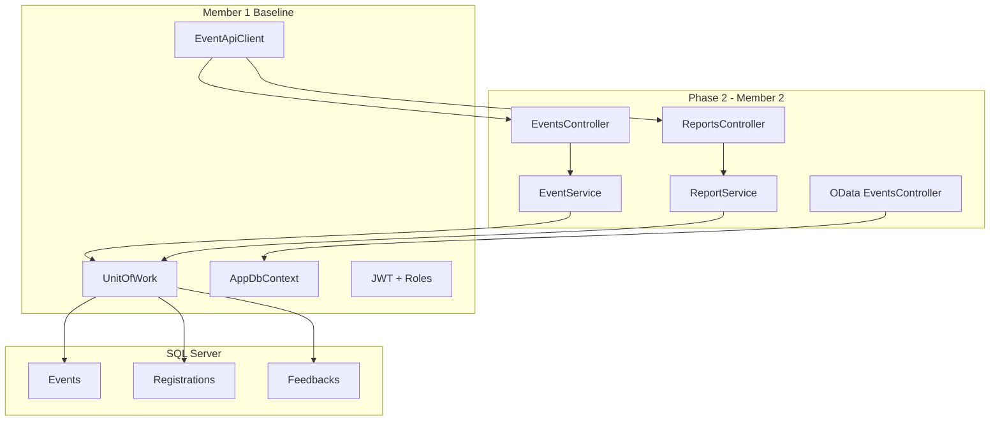
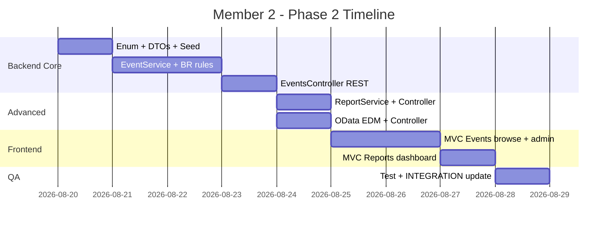

# Plan triển khai code — Thành viên 2 (Phase 2)

> **Student Event Registration System (PRN232)**  
> Phạm vi: Event Lifecycle & Analytics + OData  
> Use Cases: UC04, UC11, UC12, UC14  
> Business Rules: BR-E-01, BR-E-02, BR-E-03, BR-E-04  
> Kế thừa: [INTEGRATION.md](INTEGRATION.md), pattern từ [PLAN_Khiem_Member1.md](PLAN_Khiem_Member1.md)

---

## Checklist tiến độ

| Phase | Nội dung | Trạng thái |
|-------|----------|------------|
| 0 | EventStatus enum, NuGet OData, seed events mẫu | [ ] |
| 1 | EventDtos, ReportDtos, EventODataDto + AutoMapper | [ ] |
| 2 | EventService (UC04/11/12) + BR-E-01 → BR-E-04 | [ ] |
| 3 | EventsController + ReportsController + DI | [ ] |
| 4 | OData EDM Model + EventsODataController | [ ] |
| 5 | MVC Events + Reports (Views, ViewModels, nav) | [ ] |
| 6 | Test UC/Business Rules/OData + cập nhật INTEGRATION.md | [ ] |

---

## Bối cảnh hiện tại

Baseline Member 1 đã hoàn thành Auth, Users, Catalog và kiến trúc nền. Phase 2 bắt đầu từ trạng thái sau:

| Hạng mục | Trạng thái |
|----------|------------|
| Entity `Event` | Đã có đầy đủ field + FK trong `EventApi/Domain/Entities/Event.cs` |
| Bảng `Events`, `Registrations`, `Feedbacks` | Đã có trong migration baseline |
| Event API / Reports / OData | **Chưa có** |
| MVC Events / Reports UI | **Chưa có** |
| `Registration`, `Feedback` services (TV3) | **Chưa có** — Phase 2 chỉ **đọc** để tính `AvailableSlots` và báo cáo |



---

## Kiến trúc mục tiêu (file mới)

```
EventApi/
├── Domain/
│   └── Enums/EventStatus.cs              # NEW
├── Application/
│   ├── DTOs/EventDtos.cs                 # NEW
│   ├── DTOs/ReportDtos.cs                # NEW
│   ├── DTOs/EventODataDto.cs             # NEW (read model cho OData)
│   ├── Interfaces/IServices.cs           # + IEventService, IReportService
│   ├── Services/EventService.cs          # NEW
│   ├── Services/ReportService.cs         # NEW
│   ├── Mapping/MappingProfile.cs         # + Event maps
│   └── OData/ODataEdmModel.cs            # NEW
├── Controllers/
│   ├── EventsController.cs               # NEW
│   ├── ReportsController.cs              # NEW
│   └── OData/EventsODataController.cs    # NEW
└── Program.cs                            # + DI, AddOData()

EventRegistration.WebClient/
├── Controllers/
│   ├── EventsController.cs               # NEW (public browse + staff admin)
│   └── ReportsController.cs              # NEW
├── Models/ViewModels.cs                  # + Event*, Report* view models
└── Views/
    ├── Events/                           # NEW: Index, Details, Create, Edit, Manage
    └── Reports/                          # NEW: Index (dashboard), EventDetail
```

---

## Phase 0 — Chuẩn bị & Enum

### 0.1 Thêm `EventStatus` enum

Tạo `EventApi/Domain/Enums/EventStatus.cs`:

```csharp
public enum EventStatus
{
    Draft,
    Published,
    Ongoing,
    Completed,
    Cancelled
}
```

Entity `Event.Status` giữ kiểu `string` (đã map DB) — service layer parse/validate qua enum helper để tránh migration breaking change.

### 0.2 NuGet OData

```bash
dotnet add EventApi package Microsoft.AspNetCore.OData
```

### 0.3 Seed dữ liệu mẫu

Mở rộng `EventApi/Infrastructure/Data/DbInitializer.cs`: seed 3–5 events ở các trạng thái khác nhau (Draft, Published, Ongoing) gắn Location/Organizer seed sẵn có, `CreatedById` = staff user.

Migration (nếu chỉ seed, không đổi schema):

```bash
dotnet ef migrations add TV2_Events_Seed -p EventApi
dotnet ef database update -p EventApi
```

> Schema `Events` đã có — **không cần** migration schema trừ khi thêm index/column mới.

---

## Phase 1 — DTOs & Mapping

### 1.1 Event DTOs — `EventApi/Application/DTOs/EventDtos.cs`

| DTO | Mục đích |
|-----|----------|
| `EventListItemDto` | List/card: Id, Title, StartTime, EndTime, Status, LocationName, OrganizerName, Capacity, **AvailableSlots**, RegisteredCount |
| `EventDetailDto` | Chi tiết đầy đủ + nested Location/Organizer summary |
| `CreateEventDto` | Title, Description, StartTime, EndTime, RegistrationDeadline, Capacity, LocationId, OrganizerId |
| `UpdateEventDto` | Giống Create + không có Status (workflow riêng) |
| `EventQueryParams` | search, status, sortBy, sortDir, page, pageSize, startDate?, endDate? |

**AvailableSlots** (tính server-side):

```csharp
AvailableSlots = e.Capacity - e.Registrations.Count(r => r.Status != "Cancelled")
```

### 1.2 Report DTOs — `EventApi/Application/DTOs/ReportDtos.cs`

| DTO | Fields |
|-----|--------|
| `EventReportDto` | EventId, Title, Status, Capacity, RegisteredCount, CheckedInCount, **AttendanceRate**, **FillRate**, **AverageRating**, FeedbackCount |
| `EventsReportListDto` | `List<EventReportDto>` + paging optional |
| `OverviewReportDto` | TotalEvents, EventsByStatus, TotalRegistrations, TotalCheckedIn, OverallAttendanceRate, OverallFillRate, OverallAverageRating |

**Công thức báo cáo:**

- `FillRate` = RegisteredCount / Capacity (0 nếu Capacity = 0)
- `AttendanceRate` = CheckedInCount / RegisteredCount (Registered với Status != Cancelled)
- `AverageRating` = AVG(Feedback.Rating) per event; null/0 nếu chưa có feedback

### 1.3 OData read model — `EventODataDto`

Projection flat cho OData (tránh circular nav):

```csharp
public class EventODataDto
{
    public int Id { get; set; }
    public string Title { get; set; }
    public DateTime StartTime { get; set; }
    public DateTime EndTime { get; set; }
    public string Status { get; set; }
    public int Capacity { get; set; }
    public int RegisteredCount { get; set; }
    public int AvailableSlots { get; set; }  // computed
    public string LocationName { get; set; }
    public string OrganizerName { get; set; }
}
```

### 1.4 AutoMapper — `EventApi/Application/Mapping/MappingProfile.cs`

Map `Event` → `EventDetailDto`; list item map thủ công trong service (vì cần aggregate Registrations).

---

## Phase 2 — EventService & Business Rules

Tạo `IEventService` / `EventService` theo pattern `EventApi/Application/Services/LocationService.cs`.

### 2.1 UC04 — View & Search Events

`GetAllAsync(EventQueryParams)`:

- **Guest/Anonymous**: chỉ trả events `Published | Ongoing | Completed`
- **Staff/Admin**: thấy tất cả status (kể cả Draft, Cancelled)
- Filter: `search` (Title, Description), `status`, `startDate`/`endDate`
- Sort: `sortBy` = title | startTime | status | availableSlots (default: startTime desc)
- Paging: `PagedResult<EventListItemDto>` — reuse `EventApi/Domain/Common/Result.cs`
- Include: `.Include(e => e.Location).Include(e => e.Organizer)` + count registrations

### 2.2 UC11 — Create / Edit Event

**Create** (`POST /api/events`):

- Role: Staff, Admin
- Status mặc định: `Draft`
- `CreatedById` = userId từ JWT claim `sub`
- Validate BR-E-04 trước khi save

**Update** (`PUT /api/events/{id}`):

- Role: Staff, Admin
- **BR-E-02**: nếu Status ∈ {Completed, Cancelled} → chỉ Admin được sửa; Staff → 403
- **BR-E-03**: `Capacity` mới ≥ số registration active (`Status != "Cancelled"`)
- **BR-E-04**: validate thời gian
- Không cho sửa `Status` qua PUT (dùng workflow endpoints)

### 2.3 UC12 — Status Workflow (BR-E-01)

Tạo helper `EventWorkflow.ValidateTransition(current, target)`:

| Action | Endpoint | From → To |
|--------|----------|-----------|
| Publish | `POST /api/events/{id}/publish` | Draft → Published |
| Start | `POST /api/events/{id}/start` | Published → Ongoing |
| Complete | `POST /api/events/{id}/complete` | Ongoing → Completed |
| Cancel | `POST /api/events/{id}/cancel` | Draft \| Published \| Ongoing → Cancelled |

- Transition không hợp lệ → **409 Conflict**
- Completed / Cancelled → không transition tiếp
- Role: Staff, Admin

**BR-E-04 validation** (Create + Update):

```csharp
if (endTime <= startTime) return Fail("EndTime must be after StartTime.", 400);
if (registrationDeadline > startTime) return Fail("RegistrationDeadline must be on or before StartTime.", 400);
```

### 2.4 GetById

`GET /api/events/{id}`:

- Anonymous: chỉ xem Published/Ongoing/Completed
- Staff/Admin: xem mọi status
- 404 nếu không tồn tại hoặc không có quyền xem

---

## Phase 3 — REST Controllers

### 3.1 EventsController — `EventApi/Controllers/EventsController.cs`

Kế thừa `ApiControllerBase.cs`, route `api/events`.

| Method | Route | Auth | UC |
|--------|-------|------|-----|
| GET | `/api/events?search=&status=&sortBy=&page=&pageSize=` | Anonymous (filtered) | UC04 |
| GET | `/api/events/{id}` | Anonymous (filtered) | UC04 |
| POST | `/api/events` | Staff, Admin | UC11 |
| PUT | `/api/events/{id}` | Staff, Admin | UC11 |
| POST | `/api/events/{id}/publish` | Staff, Admin | UC12 |
| POST | `/api/events/{id}/start` | Staff, Admin | UC12 |
| POST | `/api/events/{id}/complete` | Staff, Admin | UC12 |
| POST | `/api/events/{id}/cancel` | Staff, Admin | UC12 |

Inject `IHttpContextAccessor` để lấy userId + role cho visibility/filter logic.

### 3.2 ReportsController — `EventApi/Controllers/ReportsController.cs`

Route prefix `api/reports`, auth **Staff, Admin**:

| Method | Route | UC |
|--------|-------|-----|
| GET | `/api/reports/event/{id}` | UC14 — báo cáo 1 event |
| GET | `/api/reports/events?status=&page=` | UC14 — danh sách per-event |
| GET | `/api/reports/overview` | UC14 — dashboard tổng quan |

### 3.3 DI — `EventApi/Program.cs`

```csharp
builder.Services.AddScoped<IEventService, EventService>();
builder.Services.AddScoped<IReportService, ReportService>();
```

---

## Phase 4 — ASP.NET Core OData

### 4.1 EDM Model — `EventApi/Application/OData/ODataEdmModel.cs`

```csharp
public static IEdmModel GetEdmModel()
{
    var builder = new ODataConventionModelBuilder();
    builder.EntitySet<EventODataDto>("Events");
    return builder.GetEdmModel();
}
```

### 4.2 Cấu hình Program.cs

```csharp
builder.Services.AddControllers()
    .AddOData(options => options
        .Select().Filter().OrderBy().Count().SetMaxTop(100)
        .AddRouteComponents("odata", ODataEdmModel.GetEdmModel()));
```

### 4.3 OData Controller — `GET /odata/Events`

```csharp
[Authorize(Roles = "Staff,Admin")]
public class EventsODataController : ODataController
{
    [EnableQuery(PageSize = 20, AllowedQueryOptions = All)]
    public IQueryable<EventODataDto> Get()
    {
        return _context.Events
            .Select(e => new EventODataDto {
                Id = e.Id,
                Title = e.Title,
                // ...
                RegisteredCount = e.Registrations.Count(r => r.Status != "Cancelled"),
                AvailableSlots = e.Capacity - e.Registrations.Count(r => r.Status != "Cancelled"),
                LocationName = e.Location.Name,
                OrganizerName = e.Organizer.Name
            });
    }
}
```

**Query options hỗ trợ:** `$filter`, `$orderby`, `$select`, `$top`, `$skip`, `$count`

**Filter AvailableSlots** — hoạt động vì field được project trong `Select` trước `[EnableQuery]`.

**Ví dụ test:**

```
GET /odata/Events?$filter=AvailableSlots gt 0 and Status eq 'Published'&$orderby=StartTime desc&$top=10&$count=true
```

---

## Phase 5 — MVC WebClient

Theo pattern `EventRegistration.WebClient/Controllers/LocationsController.cs` + `EventApiClient.cs`.

### 5.1 ViewModels — `EventRegistration.WebClient/Models/ViewModels.cs`

- `EventListItemViewModel`, `EventDetailViewModel`, `CreateEventViewModel`, `EditEventViewModel`
- `PagedEventsViewModel`, `EventReportViewModel`, `OverviewReportViewModel`

### 5.2 EventsController (MVC)

| Action | Route | Role | Mô tả |
|--------|-------|------|-------|
| `Index` | `/Events` | All | UC04 — card/table, search box, filter status/date, paging |
| `Details` | `/Events/Details/{id}` | All | Chi tiết + AvailableSlots |
| `Create` | `/Events/Create` | Staff, Admin | UC11 — form tạo Draft |
| `Edit` | `/Events/Edit/{id}` | Staff, Admin | UC11 — form sửa |
| `Manage` | `/Events/Manage/{id}` | Staff, Admin | UC12 — nút Publish/Start/Complete/Cancel |
| `Publish/Start/Complete/Cancel` | POST actions | Staff, Admin | Gọi workflow API |

Dropdown Location/Organizer: load từ `/api/locations`, `/api/organizers` (đã có).

### 5.3 ReportsController (MVC)

| Action | Route | Role |
|--------|-------|------|
| `Index` | `/Reports` | Staff, Admin |
| `EventDetail` | `/Reports/Event/{id}` | Staff, Admin |

Hiển thị: AttendanceRate, FillRate, AverageRating dạng % hoặc progress bar Bootstrap.

### 5.4 Navigation — `Views/Shared/_Layout.cshtml`

- **Events** — hiển thị cho mọi user (browse)
- **Manage Events** / **Reports** — chỉ Staff, Admin (giống pattern Users nav cho Admin)

---

## Phase 6 — Kiểm thử & Handoff

### 6.1 Checklist Use Cases

- [ ] **UC04**: Search keyword, filter status, sort, paging; AvailableSlots đúng
- [ ] **UC11**: Staff tạo Draft; sửa schedule/capacity/location/organizer
- [ ] **UC12**: Workflow đầy đủ; transition sai → 409
- [ ] **UC14**: Report per-event + overview; metrics đúng khi có/không có registration/feedback

### 6.2 Checklist Business Rules

- [ ] **BR-E-01**: Chỉ transition hợp lệ
- [ ] **BR-E-02**: Staff không sửa Completed/Cancelled; Admin được
- [ ] **BR-E-03**: Giảm Capacity dưới registered count → 400/409
- [ ] **BR-E-04**: EndTime > StartTime; RegistrationDeadline ≤ StartTime

### 6.3 OData test cases

- [ ] `$filter=AvailableSlots gt 0`
- [ ] `$orderby=StartTime desc`
- [ ] `$select=Title,AvailableSlots,Status`
- [ ] `$top=5&$skip=5&$count=true`

### 6.4 Cập nhật integration doc

Thêm section TV2 vào `docs/INTEGRATION.md`: endpoints, role matrix, contract `AvailableSlots`, phụ thuộc TV3 cho registration data thật.

### 6.5 Test accounts

| Email | Password | Role | Dùng để test |
|-------|----------|------|--------------|
| staff@fpt.edu.vn | Staff@123 | Staff | CRUD + workflow + reports |
| admin@fpt.edu.vn | Admin@123 | Admin | Sửa event Completed/Cancelled |

---

## Authorization Matrix (tổng hợp)

| Endpoint | Anonymous | Student | Staff | Admin |
|----------|-----------|---------|-------|-------|
| GET `/api/events` (Published+) | Yes | Yes | All status | All status |
| GET `/api/events/{id}` (Published+) | Yes | Yes | All | All |
| POST/PUT `/api/events` | No | No | Yes | Yes |
| Workflow POST | No | No | Yes | Yes |
| GET `/api/reports/*` | No | No | Yes | Yes |
| GET `/odata/Events` | No | No | Yes | Yes |
| Edit Completed/Cancelled | — | No | No | Yes (BR-E-02) |

---

## Timeline đề xuất



**Thứ tự ưu tiên unblock nhóm:** EventService + REST API trước → OData + Reports → MVC (có thể làm song song Reports/OData sau khi EventService xong).

---

## Mapping Matrix — Thành viên 2

| Hạng mục | Chi tiết |
|----------|----------|
| Use Cases | UC04, UC11, UC12, UC14 |
| Entities | Event (mở rộng logic; đọc Registration, Feedback) |
| REST Endpoints | `/api/events/*`, `/api/reports/*` |
| OData | `GET /odata/Events` |
| MVC Views | Events Index/Details/Create/Edit/Manage, Reports Dashboard |
| Advanced Tech | ASP.NET Core OData ($filter, $orderby, $select, $top, $skip, $count) |
| Business Rules | BR-E-01, BR-E-02, BR-E-03, BR-E-04 |

---

## Lưu ý phối hợp TV3

- Phase 2 **không implement** Registration/Feedback API (scope TV3).
- `AvailableSlots` và Reports query trực tiếp bảng `Registrations`/`Feedbacks` — khi TV3 seed data, metrics tự cập nhật.
- Tránh sửa entity/schema của TV3; nếu TV3 đổi `Registration.Status` values, cập nhật filter `!= "Cancelled"` cho đồng bộ.
